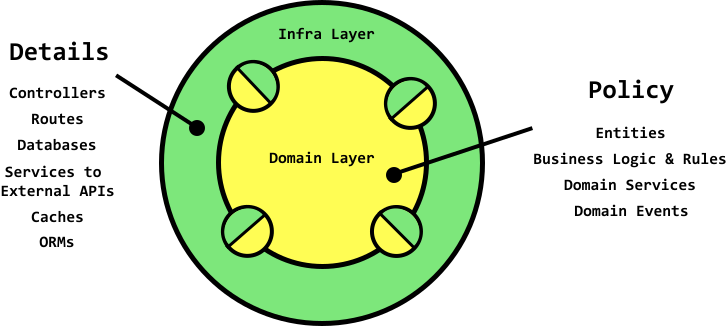

# The clean architecture
`Robert C. Martin`

A simplification of the architecture.

Those small half-circles are meant to signify writing interfaces (at the policy level) to be implemented by the detail level.

